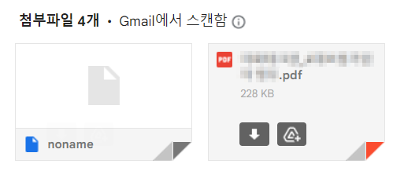

# DAT 파일을 여는 방법

간혹 업무 중 메일을 받을 때 .dat 파일가 첨부되어 있을 때가 있습니다.

아래와 같이 winmail.dat 파일이 첨부되어 있는 경우입니다.

참고로 저는 다음 메일(Daum Mail) 시스템을 사용중입니다.

다양한 방법들이 있겠지만, 저는 지메일(Gmail)을 통해 열어봅니다.

아래 순서대로 따라해보시면 됩니다. 아주 간단합니다.

1. winmail.dat 파일이 첨부된 메일을 Gmail로 전달한다.
2. Gmail로 들어가서 해당 메일을 확인한다.
3. 아래 이미지처럼 첨부된 파일을 확인할 수 있다.

위와 같이 첨부된 파일을 확인할 수 있습니다.

물론 noname 파일이나 다른 첨부파일도 함께 들어있는 경우가 있지만,

직접 확인해보시면 실제 내가 받아볼 파일이 어떤건지 바로 알아보실겁니다.

물론 변환을 한다거나, 다른 방식이 있겠지만

별도의 프로그램이나 귀찮은 작업을 할 필요가 없어서 저는 Gmail을 이용하는 방법을 씁니다.

제 방법이 도움이 되면 좋겠습니다.

